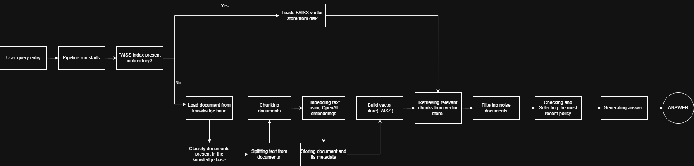
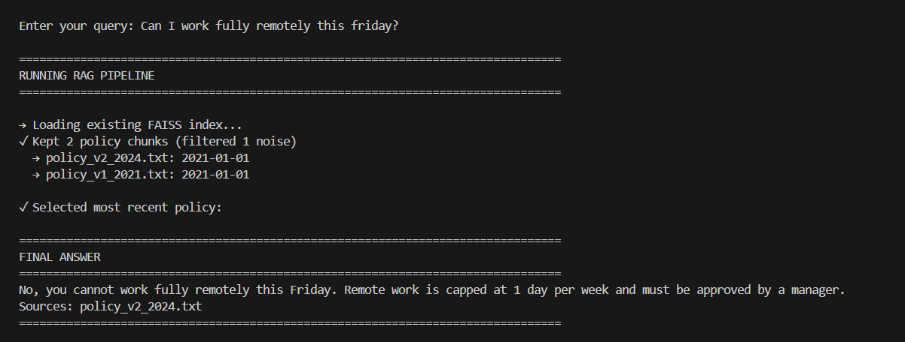

# HR Policy RAG System 🤖

A production-grade **Retrieval-Augmented Generation (RAG)** pipeline that intelligently resolves conflicting policy versions, filters irrelevant documents, and provides accurate answers with source citations.


## 🎯 Overview

This RAG system solves a common enterprise problem: **handling conflicting policy documents**. When HR departments update policies without deleting old versions, employees need a way to find the **most current** policy while ignoring irrelevant documents.

---

## ✨ Features

### Core Capabilities

- **🔍 Intelligent Document Retrieval** - Uses FAISS vector similarity search
- **📅 Multi-Strategy Date Extraction** - Extracts dates from content, filename, or file metadata
- **🗑️ Noise Filtering** - Automatically excludes irrelevant documents
- **⚖️ Conflict Resolution** - Always selects the most recent policy version
- **📝 Source Citation** - Every answer includes filename references
- **🚀 Production-Ready** - Comprehensive logging and error handling

### Technical Highlights

- **FAISS Vector Store** - Fast semantic search with OpenAI embeddings
- **LangChain Integration** - Modular components for easy extension
- **Fallback Mechanisms** - Never fails due to missing dates
- **Metadata Inheritance** - Preserves document metadata through chunking
- **Efficient Caching** - Vector store saved to disk for fast subsequent runs

---

## 🏗️ System Architecture

### Pipeline Flowchart



### Component Diagram

```
┌─────────────────────────────────────────────────────────────────┐
│                     RAG PIPELINE COMPONENTS                      │
├─────────────────────────────────────────────────────────────────┤
│                                                                   │
│  ┌──────────────┐    ┌──────────────┐    ┌──────────────┐      │
│  │  Document    │───▶│   Chunking   │───▶│  Embedding   │      │
│  │   Loader     │    │   Engine     │    │   (OpenAI)   │      │
│  └──────────────┘    └──────────────┘    └──────────────┘      │
│         │                                          │             │
│         │                                          ▼             │
│         │                                  ┌──────────────┐     │
│         │                                  │    FAISS     │     │
│         │                                  │ Vector Store │     │
│         │                                  └──────────────┘     │
│         │                                          │             │
│         ▼                                          │             │
│  ┌──────────────┐                                 │             │
│  │   Metadata   │                                 │             │
│  │  Extraction  │                                 │             │
│  │  • Dates     │                                 │             │
│  │  • Types     │                                 │             │
│  └──────────────┘                                 │             │
│                                                    ▼             │
│  ┌──────────────┐    ┌──────────────┐    ┌──────────────┐     │
│  │     LLM      │◀───│  Conflict    │◀───│    Noise     │     │
│  │  Generation  │    │  Resolution  │    │   Filtering  │     │
│  │(GPT-4o-mini) │    │  (By Date)   │    │  (By Type)   │     │
│  └──────────────┘    └──────────────┘    └──────────────┘     │
│         │                                          ▲             │
│         │                                          │             │
│         ▼                                          │             │
│  ┌──────────────────────────────────────────────────┐          │
│  │              FINAL ANSWER                         │          │
│  │         (With Source Citation)                    │          │
│  └──────────────────────────────────────────────────┘          │
│                                                                  │
└──────────────────────────────────────────────────────────────────┘
```

---

## 📦 Prerequisites

Before you begin, ensure you have the following installed:

- **Python 3.8+** (3.9 or 3.10 recommended)
- **pip** (Python package manager)
- **OpenAI API Key** ([Get one here](https://platform.openai.com/api-keys))
- **Git** (optional, for cloning)

---

## 🚀 Installation

### Step 1: Clone or Download the Repository

```bash
# Option A: Clone with Git
git clone https://github.com/yourusername/conflicting-policy-rag.git
cd conflicting-policy-rag

# Option B: Download ZIP
# Download and extract the ZIP file, then navigate to the folder
cd conflicting-policy-rag
```

### Step 2: Create Virtual Environment

**Windows:**
```bash
python -m venv venv
venv\Scripts\activate
```


### Step 3: Install Dependencies

```bash
pip install -r requirements.txt
```

**Required packages:**
```
langchain==0.1.0
langchain-community==0.0.13
langchain-openai==0.0.5
openai==1.7.2
faiss-cpu==1.7.4
python-dotenv==1.0.0
```

### Step 4: Create Knowledge Base

Create a folder named `knowledge_base` and add your policy documents:

```bash
Bash- mkdir knowledge_base
```

---

## ⚙️ Configuration

### Step 1: Create Environment File

Create a `.env` file in the project root and add the below variable:

```bash
OPENAI_API_KEY=sk-your-actual-api-key-here
```

### Step 2: Configure Settings (Optional)

You can modify these constants in the script:

```python
# In rag_pipeline.py

KNOWLEDGE_BASE_DIR = "knowledge_base"  # Path to documents
FAISS_INDEX_DIR = "faiss_index"        # Vector store location
CHUNK_SIZE = 500                        # Max-Characters per chunk
TOP_K = 6                               # Number of chunks to retrieve
```

**To run:**
```bash
python rag_pipeline.py
```
---

### First Run vs. Subsequent Runs

**First Run (Building Vector Store):**
- Takes a bit longer
- Creates `faiss_index/` folder
- Embeds all documents

**Subsequent Runs (Loading Vector Store):**
- Takes little time
- Loads from disk
- Much faster!

### Rebuilding Vector Store

If you modify documents in `knowledge_base/`, delete the existing vector store to rebuild:

```bash
# Remove existing index
rm -rf faiss_index/    # macOS/Linux
rmdir /s faiss_index\  # Windows

# Run again to rebuild
python rag_pipeline.py
```


### File Descriptions

| File | Purpose | Required |
|------|---------|----------|
| `rag_pipeline.py` | Main script with all RAG logic | ✅ Yes |
| `requirements.txt` | Python package dependencies | ✅ Yes |
| `.env` | OpenAI API key configuration | ✅ Yes |
| `.gitignore` | Git ignore rules | ⚠️ Recommended |
| `knowledge_base/` | Policy documents directory | ✅ Yes |
| `faiss_index/` | Vector embeddings (auto-created) | ⚙️ Auto |

---


## 🎉 Next Steps

Now that you have the system running:

1. ✅ Test with the sample queries
2. ✅ Add your own policy documents
3. ✅ Customize the prompts for your use case

**Happy RAG building!** 🚀

---

### Sample Input-Output



<div align="center">


[⬆ Back to Top](#hr-policy-rag-system-)

</div>